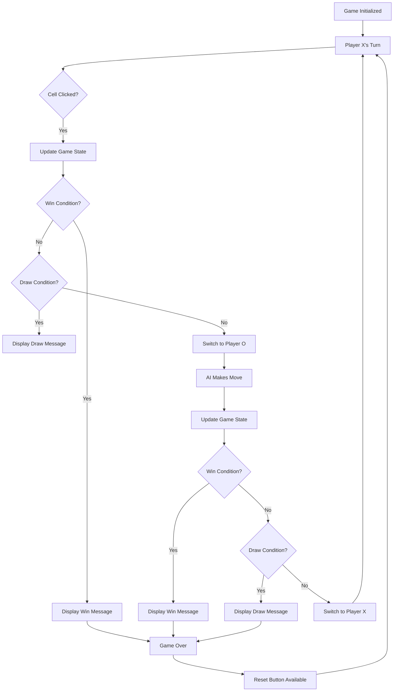

# Tic Tac Toe Game with AI

A classic Tic Tac Toe game implemented with HTML, CSS, and JavaScript, featuring an AI opponent that uses strategic logic to play against the user.

## Table of Contents
1. [Project Overview](#project-overview)
2. [File Structure](#file-structure)
3. [Game Features](#game-features)
4. [How to Play](#how-to-play)
5. [Technical Implementation](#technical-implementation)
6. [Workflow](#workflow)
7. [Running the Game](#running-the-game)

## Project Overview

This is a fully functional Tic Tac Toe game where players can compete against an AI opponent. The game features:
- Responsive design that works on mobile and desktop
- Visual feedback for game states
- Strategic AI that makes intelligent moves
- Game status display
- Reset functionality

## File Structure

```
tic-tac-toe-game/
├── index.html          # Main HTML structure
├── style.css           # Styling and responsive design
├── script.js           # Game logic and AI implementation
└── README.md           # Project documentation
```

## Game Features

- **Player vs AI**: Play against an intelligent AI opponent
- **Visual Design**: Modern gradient background with clean game board
- **Responsive Layout**: Adapts to different screen sizes
- **Game Status**: Shows current player, win/draw messages
- **Interactive Elements**: Hover effects and smooth animations
- **Reset Functionality**: Start a new game at any time

## How to Play

1. The game starts with Player X (you) going first
2. Click on any empty cell to place your mark (X)
3. The AI (O) will automatically make its move after yours
4. Try to get three of your marks in a row (horizontally, vertically, or diagonally)
5. If all cells are filled with no winner, the game ends in a draw
6. Use the "Reset Game" button to start a new game at any time

## Technical Implementation

### HTML Structure (`index.html`)
- Semantic HTML5 structure with proper document type
- Grid-based game board with 3x3 cells
- Game information display (current player, status)
- Responsive design using CSS Flexbox and Grid

### CSS Styling (`style.css`)
- Gradient background for visual appeal
- Responsive design with media queries for mobile
- Hover effects and transitions for interactive elements
- Cell styling with different colors for X and O
- Shadow effects and rounded corners for modern look

### JavaScript Logic (`script.js`)
- Game state management (current player, board state, game active flag)
- Win detection using predefined patterns
- Draw detection when board is full
- AI logic with strategic priority:
  1. Win if possible
  2. Block player from winning
  3. Take center if available
  4. Take corner
  5. Take any available spot
- Event listeners for user interactions
- Reset functionality

## Workflow



## Running the Game

To play the game:
1. Save all files in the same directory
2. Open `index.html` in any modern web browser
3. Start playing immediately!

The game is completely self-contained and requires no external dependencies or installation.

## Game Logic Details

### Win Detection
The game checks for wins using 8 predefined patterns:
- 3 rows
- 3 columns  
- 2 diagonals

### AI Strategy
The AI follows this priority order:
1. **Win**: If AI can win in one move, it does so
2. **Block**: If player can win in one move, AI blocks it
3. **Center**: Take the center position if available
4. **Corners**: Take a corner position if available
5. **Random**: Take any available position

### Game States
- **Active**: Game in progress
- **Win**: Game ended with a winner
- **Draw**: Game ended in a tie

## Customization

The game can be easily customized:
- Modify colors in `style.css`
- Adjust AI difficulty by changing the logic in `script.js`
- Change board size by modifying HTML and JavaScript
- Add sound effects or animations

## Browser Compatibility

This game works in all modern browsers including:
- Chrome 60+
- Firefox 55+
- Safari 10+
- Edge 15+